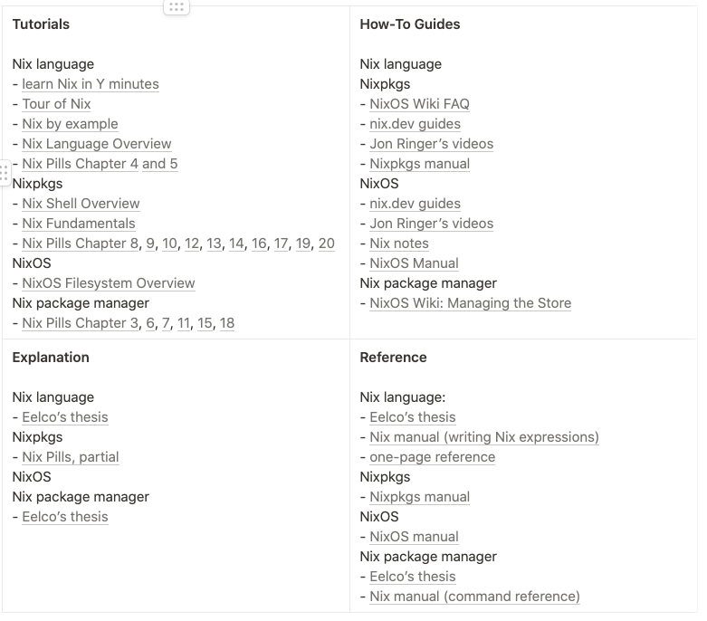

# Suggestions to improve Nix documentation

A haphazard collection of notes in my effort to consolidate every piece of hand-written notes and online communications I had about this topic. (TODO: clean up redundancy and format)

+ Every definition is written on their own line, and not like prose (e.g., one paragraph riddled with definitions; mention a term, and defined it in the next sentence or, god forbid, a couple of sentences below)

+ Description, examples, caveats, etc. of a concept should be in close proximity to the definition. This is not always feasible, but make an effort. Counter examples: "derivation" in the thesis; outPath & drvPath; ?

+ **experiment** Create a Nix documentation layer over Stackoverflow (and similar sites). For example, start with "_What is Nix?_" and gradually link to subsequent topics by creating newthreads or incorporating existing ones.

+ [PR#6420 Document what Nix *is*](https://github.com/NixOS/nix/pull/6420)

+ a **function reference** with *tons of examples* and *link to source code*
   
   I rarely know where stuff is coming from (builtins? stdlib?), and finding the implementations is not easy (sometimes don't even know which repo I should be searching in). An example is my journey with `callPackage`: [part 1](https://stackoverflow.com/questions/56121361/where-is-callpackage-defined-in-the-nixpkgs-repo-or-how-to-find-nix-lambda-de), [part 2](https://discourse.nixos.org/t/where-is-callpackage-defined-exactly-part-2/12524) (not to mention [this 4 year old open issue regarding `callPackage` vs `callPackages`](https://github.com/NixOS/nixpkgs/issues/36354))

+ documenting Nixpkgs helper modules, mechanisms, and architecture

+ document implementations of derivations

   The source is clearly there, but every derivation is like its own project, especially if the software is complex enough (various language environments , e.g., erlang; editors with all their plugin ecosystem and customizable builds, etc.). The various sections in the Nixpkgs manual go into the details but sometimes it is more confusing then having been left to one's own devices.

+ formal specification or, at least, consistently updated manual of the Nix expression language

  Even the answers to some of the basics questions are to look at the source; case in point: [What is a valid identifier?](https://stackoverflow.com/questions/56198420/what-is-the-syntax-of-a-valid-identifier-in-the-nix-language). 

+ recommend "**reading paths**" (i.e., suggest an order to consume the documentation)

   What I constantly keep thinking about is how could the manuals be re-worked. The idea of having 3 separate ones that are treated as isolated monoliths is not helpful, because each has topics that requires pre-requisite knowledge from the others. It would be nice to have a recommended reading path (or more; even better, user created ones) on how to traverse the manuals (and other official docs) in a way that makes the most sense (e.g., waypoint1: Nix manual, chapter 1; waypoint2: Nixpkgs manual, introduction; etc.) Or just re-imagine the whole thing and maybe even start from scratch in its own repo.

   The detailed notes regarding Nix topics of Valentin Gagarin (fricklerhandwerk):

   

